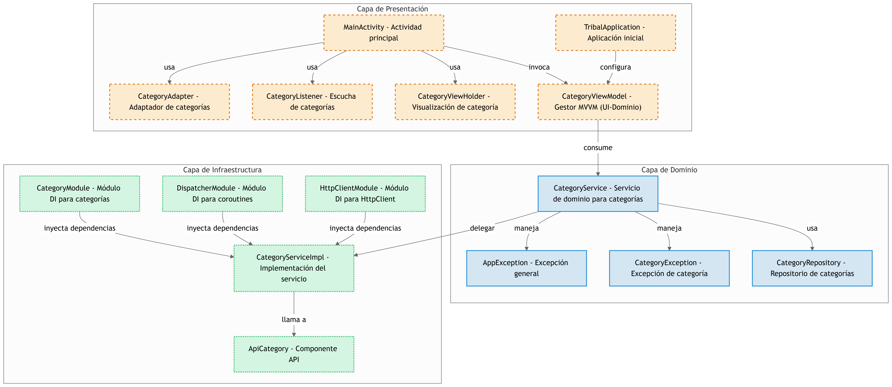

**Challenge Técnico para Tribal**

Aplicación que se encarga de mostrar categorias con la API de mocks https://api.chucknorris.io/jokes/categories sugerida en el reto

---

## Descripción

Esta aplicación permite listar diferentes categorías utilizando la API de Chuck Norris Jokes, como se especifica en el reto técnico. Ha sido desarrollada siguiendo buenas prácticas de programación, aplicando principios de arquitectura limpia, el patrón MVVM y el uso de coroutines para el manejo de asincronía.

### Arquitectura y Estructura

La aplicación está organizada en tres capas principales::

* **Presentación**: Esta capa es responsable de la interfaz de usuario.
* **Dominio**: Esta capa es responsable de la lógica de negocio
* **Infraestructura**: Esta capa es responsable de la comunicación con el back-end (API's).

---

## Diagrama arquitectura

---

## 1. Presentación (Ui Layer)

Responsable de la interfaz de usuario y la interacción con el usuario. Se compone de los siguientes paquetes:

* **adapter** Contiene los adaptadores y ViewHolders necesarios para mostrar las categorías en la interfaz.
* **ui** Contiene las actividades, fragmentos y recursos visuales de la aplicación.
* **viewmodels** Implementa los ViewModel encargados de manejar la lógica de presentación y la comunicación con la capa de dominio.

---

## 2. Dominio (Domain Layer)

Encargada de la lógica de negocio y la definición de los modelos de datos. Contiene los siguientes paquetes:

* **exception** Define los diferentes tipos de excepciones que se manejan en la aplicación.
* **repository** Define los contratos de los repositorios que permiten obtener datos de la API o de otras fuentes de datos.
* **services** Implementa la lógica de negocio y define casos de uso específicos de la aplicación.

---

## 3. Infraestructura (Data Layer)

Responsable de la comunicación con el backend y la persistencia de datos. Actúa como puente entre la capa de dominio y la de presentación. Se compone de:

* **di** Contiene la configuración de inyección de dependencias.
* **repository** Proporciona las implementaciones concretas de los repositorios definidos en la capa de dominio.
* **api** En este paquete se encuentran los endpoint.

---
